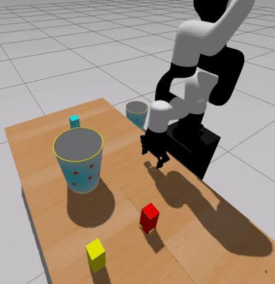
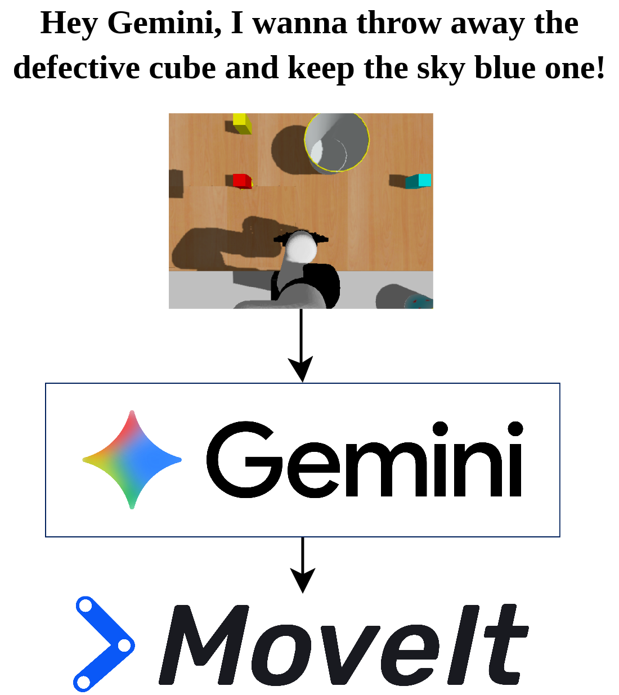

# Proyecto Final: Pick and Place con Gemini Robotics y MoveIt

<div align="center">
  <table>
    <tr>
      <td align="center">
        
      </td>
      <td align="center">
        
      </td>
    </tr>
  </table>
</div>

## Descripción del Proyecto

Este proyecto integra **Gemini Robotics** (un foundation model de Google) como planificador de alto nivel junto con **MoveIt 2** para realizar tareas de pick-and-place en un entorno simulado con Gazebo. El objetivo es demostrar cómo un modelo de visión por computadora puede trabajar en conjunto con un planificador de movimiento para realizar tareas de manipulación complejas.

## Objetivo

Utilizar Gemini Robotics para:
1. **Detectar** objetos en la escena (cubo defectuoso, cubo azul cielo, y basket)
2. **Localizar** sus posiciones 3D usando la geometría de la cámara
3. **Planificar** tareas de pick-and-place que MoveIt ejecutará

La idea es que Gemini funcione como un "planificador de alto nivel" que decide qué hacer, mientras que MoveIt se encarga del planeamiento de trayectorias y ejecución del movimiento del robot.

## Configuración Inicial

### Iniciar la Simulación

Antes de ejecutar el script principal, debes iniciar la simulación de Gazebo con MoveIt:

```bash
ros2 launch xarm_moveit_config xarm6_moveit_gazebo.launch.py \
    robot_x:=0.0 \
    robot_y:=-0.4 \
    robot_z:=0.45 \
    robot_yaw:=1.5708 \
    world:=table_color_objects_project.world \
    add_gripper:=true \
    enable_depth_camera:=true
```

**Parámetros importantes:**
- `world:=table_color_objects_project.world`: Mundo que contiene los cubos y contenedores
- `add_gripper:=true`: Incluye el gripper en la simulación
- `enable_depth_camera:=true`: **CRÍTICO** - Habilita la cámara de profundidad para el octomap, necesario para evitar colisiones

## Flujo del Proyecto

### Tarea 1: Cubo Defectuoso → Trash Bin

1. **Detección con Gemini**: 
   - Gemini detecta el cubo defectuoso (rojo con base deformada) en la imagen de la cámara
   - Devuelve coordenadas 2D normalizadas (píxeles)

2. **Conversión 2D → 3D**:
   - Usando la geometría de la cámara (parámetros intrínsecos, TF transforms)
   - Convertir coordenadas de píxel a coordenadas 3D en el frame `link_base`
   - El cubo está en el suelo, así que `z = 0.0`

3. **Pick and Place**:
   - MoveIt planifica y ejecuta el movimiento para:
     - Acercarse al cubo defectuoso
     - Agarrarlo con el gripper
     - Transportarlo al trash bin
     - Soltarlo en la posición del trash bin

### Tarea 2: Cubo Azul Cielo → Basket

1. **Detección con Gemini**:
   - Gemini detecta el cubo azul cielo (cyan/light blue) en la imagen
   - También detecta el basket (contenedor donde debe ir el cubo)

2. **Conversión 2D → 3D**:
   - Convertir coordenadas de ambos objetos a 3D
   - Cubo: `z = 0.0` (en el suelo)
   - Basket: `z = BASKET_Z` (altura de colocación)

3. **Pick and Place**:
   - MoveIt planifica y ejecuta el movimiento para:
     - Acercarse al cubo azul cielo
     - Agarrarlo con el gripper
     - Transportarlo al basket (usando la posición detectada)
     - Soltarlo en el basket

## Recomendación Importante: Detección Múltiple

**Límite de API de Google AI Studio**: 10 intentos por día

Para evitar alcanzar el límite máximo de intentos, **recomiendo detectar los tres objetos en una sola llamada a Gemini**:

```python
prompt = """
Detect and point to THREE objects in the image:
1. A DEFECTIVE cube
2. A SKY BLUE cube
3. The BASKET

Return all three detections in JSON format:
[
    {"point": [y, x], "label": "defective"},
    {"point": [y, x], "label": "sky_blue"},
    {"point": [y, x], "label": "basket"}
]
"""
```

Esto reduce las llamadas a la API, permitiendo más iteraciones durante el desarrollo.

## Referencias y Código de Ayuda

### Conversión 2D → 3D

Para la conversión de coordenadas de píxel a coordenadas 3D, puedes guiarte del código en:

- **`color_detector.py`**: Contiene la lógica de conversión de píxeles a coordenadas 3D usando:
  - Parámetros intrínsecos de la cámara (`fx`, `fy`, `cx`, `cy`)
  - Transformaciones TF entre frames (`camera_frame` → `link_base`)
  - Geometría de proyección inversa

**Conceptos clave:**
- Usar `tf2_ros.Buffer` para obtener transformaciones entre frames
- Aplicar la transformación de cámara a base usando quaternions y matrices de transformación
- Considerar la profundidad `Z_cam` (altura de la cámara sobre el plano)

### Planeamiento Pick and Place

Para el planeamiento y ejecución de pick-and-place, puedes usar como referencia:

1. **`pick_and_place.py`**: 
   - Ejemplo más simple y directo
   - Usa MoveItPy directamente
   - Buen punto de partida si prefieres un enfoque más controlado

2. **`pickplace_mtc_gazebo.py`** (o variantes):
   - Usa MoveIt Task Constructor (MTC)
   - Más robusto para tareas complejas
   - Mejor si necesitas más control sobre las fases del movimiento

**Elige el que te sientas más cómodo o que mejor se adapte a tu enfoque.**

### Funciones Útiles en `moveit_utils.py`

- `setup_moveit_config()`: Configura MoveItPy con los parámetros correctos
- `move_to_pose()`: Mueve el robot a una pose específica
- `set_gripper_state()`: Abre/cierra el gripper usando estados del SRDF
- `set_gripper()`: Controla el gripper con posición específica
- `get_current_pose()`: Obtiene la pose actual del end-effector

## Posiciones de Referencia

```python
# Trash bin position (para cubo defectuoso)
TRASH_X = -0.2
TRASH_Y = -0.58
TRASH_Z = 0.4  # Altura de colocación

# Basket position (para cubo azul cielo)
BASKET_Z = 0.5  # Altura de colocación
```

**Nota**: Si Gemini detecta el basket, usa la posición detectada en lugar de estas constantes.

## Ejecución

### Script de Ejemplo: Detección con Gemini

Para probar solo la detección y conversión 2D→3D sin ejecutar el pick-and-place, puedes usar el script de ejemplo:

```bash
# En una terminal, asegúrate de que Gazebo y MoveIt estén corriendo (ver Paso 1 arriba)

# En otra terminal, ejecuta el script de ejemplo:
ros2 launch xarm_scripts xarm_scripts.launch.py script:=example_gemini_detection use_sim_time:=true
```

Este script:
- Lee una imagen de `/camera/image_raw`
- Usa Gemini para detectar el cubo defectuoso
- Convierte las coordenadas de píxel a 3D
- Imprime la posición 3D del cubo defectuoso en el frame `link_base`

### Script Completo: Pick and Place

Una vez que la simulación esté corriendo, ejecuta el script completo:

```bash
ros2 launch xarm_scripts pickplace_mtc_gazebo_project_final.launch.py
```

O ejecutar directamente el script:

```bash
ros2 run xarm_scripts pickplace_project_final --ros-args -p use_sim_time:=true
```

